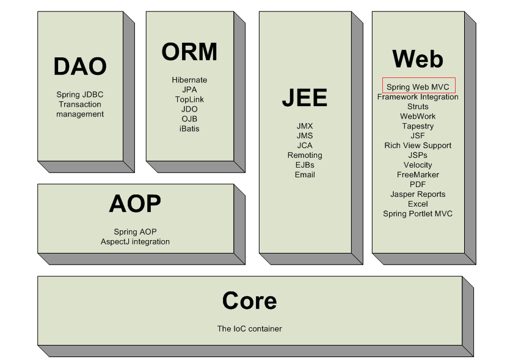
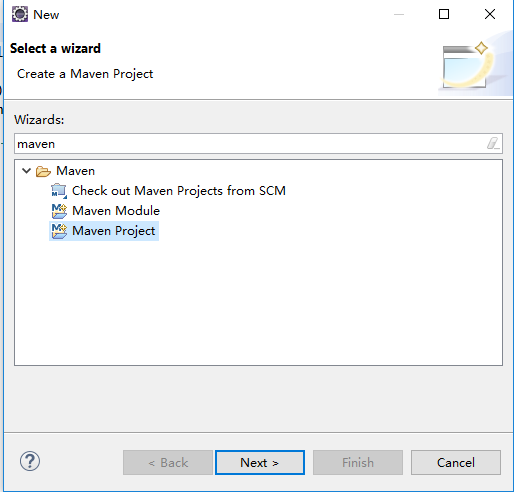
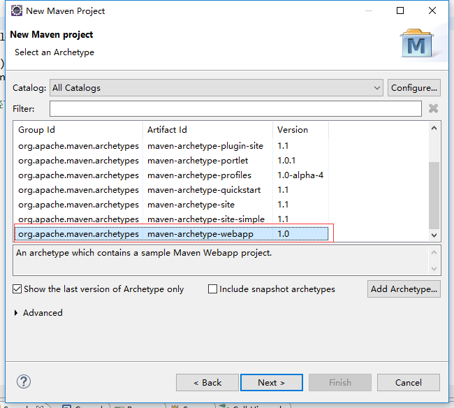
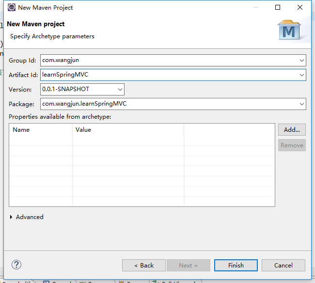

# SpringMVC入门笔记

## 1. 简介

Spring MVC是一种基于Java的实现了Web MVC设计模式的请求驱动类型的轻量级Web框架 ，是Spring系开源项目中的一个，和IoC配合使用。通过策略接口，Spring框架是高度可配置的，而且支持多种视图技术。Spring分离了控制器、模型对象、分派器以及处理程序对象的角色，这种分离让他们更容易进行定制。Spring MVC解决的问题如下：

- 将web页面的请求传给服务器；
- 根据不同的请求处理不同的逻辑单元；
- 返回处理结果数据并跳转至响应页面；

通过下面这样图可以看到Spring MVC在Spring全家桶中的位置：




## 2. Spring MVC实例

现在总结一下搭建一个完整SpringMVC的步骤，期间遇到了很多坑，404的问题坑了好久，先来记录一下成功的搭建步骤，后面附上源码。本文使用eclipse（Version: Photon Release (4.8.0)）搭建SpringMVC。

### 2.1 新建maven工程

新建一个maven project。









新建好的工程结构应该是这样的：

```
│  .classpath
│  .project
│  pom.xml
│
├─.settings
│      .jsdtscope
│      org.eclipse.jdt.core.prefs
│      org.eclipse.m2e.core.prefs
│      org.eclipse.wst.common.component
│      org.eclipse.wst.common.project.facet.core.xml
│      org.eclipse.wst.jsdt.ui.superType.container
│      org.eclipse.wst.jsdt.ui.superType.name
│      org.eclipse.wst.validation.prefs
│
├─src
│  └─main
│      ├─resources
│      └─webapp
│          │  index.jsp
│          │
│          └─WEB-INF
│                  web.xml
│
└─target
    ├─classes
    ├─m2e-wtp
    │  └─web-resources
    │      └─META-INF
    │          │  MANIFEST.MF
    │          │
    │          └─maven
    │              └─com.wangjun
    │                  └─learnSpringMVC
    │                          pom.properties
    │                          pom.xml
    │
    └─test-classes
```


### 2.2 添加pom依赖

既然是SpringMVC工程，肯定要添加SpringMVC的包，可以去http://mvnrepository.com/查找，除了SpringMVC还需要添加javax.servlet的包。

pom.xml

```xml
<project xmlns="http://maven.apache.org/POM/4.0.0" xmlns:xsi="http://www.w3.org/2001/XMLSchema-instance"
  xsi:schemaLocation="http://maven.apache.org/POM/4.0.0 http://maven.apache.org/maven-v4_0_0.xsd">
  <modelVersion>4.0.0</modelVersion>
  <groupId>com.wangjun</groupId>
  <artifactId>spring1</artifactId>
  <packaging>war</packaging>
  <version>0.0.1-SNAPSHOT</version>
  <name>spring1 Maven Webapp</name>
  <url>http://maven.apache.org</url>
  <dependencies>
    <dependency>
      <groupId>junit</groupId>
      <artifactId>junit</artifactId>
      <version>3.8.1</version>
      <scope>test</scope>
    </dependency>
    <!-- https://mvnrepository.com/artifact/org.springframework/spring-webmvc -->
	<dependency>
	    <groupId>org.springframework</groupId>
	    <artifactId>spring-webmvc</artifactId>
	    <version>4.3.18.RELEASE</version>
	</dependency>
	<!-- https://mvnrepository.com/artifact/javax.servlet/javax.servlet-api -->
	<dependency>
	    <groupId>javax.servlet</groupId>
	    <artifactId>javax.servlet-api</artifactId>
	    <version>4.0.0-b01</version>
	    <scope>provided</scope>
	</dependency>
  </dependencies>
  <build>
    <finalName>spring1</finalName>
  </build>
</project>
```

### 2.3 配置web.xml 

在web.xml中需要添加使用的servlet和映射规则。

web.xml

```xml
<!DOCTYPE web-app PUBLIC
 "-//Sun Microsystems, Inc.//DTD Web Application 2.3//EN"
 "http://java.sun.com/dtd/web-app_2_3.dtd" >

<web-app>
  <display-name>Archetype Created Web Application</display-name>
  
  <servlet>
      <servlet-name>springmvc</servlet-name>
      <servlet-class>
         org.springframework.web.servlet.DispatcherServlet
      </servlet-class>
      <load-on-startup>1</load-on-startup>
   </servlet>

   <servlet-mapping>
      <servlet-name>springmvc</servlet-name>  <!-- 需要和上面的servlet-name保持一致 -->
      <url-pattern>/</url-pattern> <!-- url的匹配规则，/ 就是匹配所有 -->
   </servlet-mapping>
</web-app>
```

### 2.4 新建springmvc-servlet.xml文件

在web.xml同级目录下新建springmvc-servlet.xml文件（就是在web.xml配置的servletName+servlet）。这里面负责配置映射类和视图适配器等。

springmvc-servlet.xml

```xml
<?xml version="1.0" encoding="UTF-8"?>
<beans xmlns="http://www.springframework.org/schema/beans"
	xmlns:xsi="http://www.w3.org/2001/XMLSchema-instance" xmlns:context="http://www.springframework.org/schema/context"
	xmlns:tx="http://www.springframework.org/schema/tx" xmlns:mvc="http://www.springframework.org/schema/mvc"
	xsi:schemaLocation="http://www.springframework.org/schema/beans 
       http://www.springframework.org/schema/beans/spring-beans.xsd 
       http://www.springframework.org/schema/context 
       http://www.springframework.org/schema/context/spring-context.xsd 
       http://www.springframework.org/schema/tx 
       http://www.springframework.org/schema/tx/spring-tx.xsd
   	   http://www.springframework.org/schema/mvc
       http://www.springframework.org/schema/mvc/spring-mvc.xsd">
       
   <!-- 注册HandlerMapper、HandlerAdapter两个映射类（不写会导致404问题） -->
   <mvc:annotation-driven/>

	<!-- 下面是配置扫描包的位置,包名为com.learnspringmvc,也就是说我们的视图解析器应该放在com.learnspringmvc包下 -->
   <context:component-scan base-package="com.learnspringmvc" />
   
   <mvc:default-servlet-handler/>
   
   <bean id="viewResolver" class="org.springframework.web.servlet.view.InternalResourceViewResolver">
   	  <!-- 前缀,我们的视图文件应该放到/WEB-INF/jsp/目录下,这里我们需要在WEB-INF下面创建jsp文件夹 -->  
      <property name="prefix" value="/WEB-INF/jsp/" />
      <!-- 设置后缀为.jsp -->
      <property name="suffix" value=".jsp" />
   </bean>
</beans>
```

### 2.5 新建页面jsp文件

在WEB-INF下新建jsp文件夹，然后在jsp下新建demo.jsp

demo.jsp

```jsp
<%@ page language="java" contentType="text/html; charset=ISO-8859-1"
    pageEncoding="ISO-8859-1"%>
<!DOCTYPE html>
<html>
<head>
<meta charset="ISO-8859-1">
<title>Insert title here</title>
</head>
<body>
Hello springMVC!
</body>
</html>
```

### 2.6 新建controller控制类

在main文件夹下新建java文件夹，在新建HelloController.java文件，包名为com.learnspringmvc.controllers。

```java
package com.learnspringmvc.controllers;

import org.springframework.stereotype.Controller;
import org.springframework.web.bind.annotation.RequestMapping;

//控制器注解
@Controller
@RequestMapping("/hello")
public class HelloController {

	@RequestMapping("/showdemo")
	public String getString() {
		
		// 必须在配置的view路径下存在demo.jsp,否则返回404
		return "demo";
	}

}
```

### 2.7 编译打包

进入到项目的根目录下（pom.xml存在的文件夹），打开doc，执行`mvc install`，出现`BUILD SUCCESS`表示打包成功，在target文件夹下生成`learnSpringMVC.war`，将此war包移动到tomcat的webapps下面，重启服务器，访问http://localhost:8080/learnSpringMVC/hello/showdemo：（注意：8080：后面紧跟的不是在web.xml中配置的servlet-name，而是在pom.xml中build的finalName属性）


### 2.8 关于404问题的坑

在搭建工程的时候，访问页面显示404，困扰了很久，也在网上搜了很多答案，这是一篇质量比较高的：https://blog.csdn.net/baidu_15275441/article/details/73930961。404问题很难排查，因为并没有报错和堆栈信息，只能一个一个的排查可能的问题，写这边博客的时候又发现了一个导致404的原因，就是上面2.7写到的：8080：后面紧跟的不是在web.xml中配置的servlet-name，而是在pom.xml中build的finalName属性。可见404问题无处不见，由于自己对SpringMVC框架只是个小白，只能搜索加尝试。希望后面能成为大神级别的。这种问题都是小case。

>  **源码：**https://github.com/WangJun-SCU/LearnSpringMVC

## 3. SSH个SSM两个框架的区别

SSH(Spring，Struts，Hibernate)和SSM(Spring，SpringMVC，MyBatis)的区别其实就是SpringMVC和Struts，Hibernate和MyBatis的区别。

### 3.1 SpringMVC和Struts的区别

1. Struct和Spring-MVC都是负责取转发的，但是两者针对request的请求上面区别很大，Struct是针对一个Action类来进行请求的，即一个Action类对应于一个请求，所以类拦截，请求的数据类共享。而Spring-MVC则是针对于方法级别的请求的，也就是一个方法对应于一个请求，属于方法拦截，请求的数据方法不共享。
2. Spring-MVC的配置文件相对来说较为少，容易上手，可以加快软件开发的速度。
3. Spring-MVC的入口是Servlet级别的而Struct的级别是Filter级别的。

### 3.2 Hibernate和MyBatis的区别

1. Hibernate是一种O/R关系型，即完成数据库表和持久化类之间的映射，而MyBitas是针对的SQL-Mapping，Hibernate把数据库给封装好以后，可以调用相应的数据库操作语句SQL，而MyBitas则是用的原始的数据库操作语句。基于此原因，Hibernate优化起来相对MyBitas较难。
2. MyBitas入门较快，而Hibernate掌握起来相对较难。
3. 针对高级查询，Mybatis需要手动编写SQL语句，以及ResultMap。而Hibernate有良好的映射机制，开发者无需关心SQL的生成与结果映射，可以更专注于业务流程。
4. Hibernate数据库移植性很好，MyBatis的数据库移植性不好，不同的数据库需要写不同SQL。

### 3.3 总结：

SSH很笨重，现在除了一些老系统，很少有人使用SSH了，SSM则是现在的主流，当前还有SpringBoot，SpringCloud微服务这些。


> 参考：
>
> https://www.cnblogs.com/ysocean/p/7375405.html
>
> https://blog.csdn.net/horero/article/details/54236833
>
> SpringMVC映射的前端后台数据交互总结：https://blog.csdn.net/xiansky2015/article/details/79050772
>
> 基于注解的入门实例：https://www.cnblogs.com/ysocean/p/7400987.html